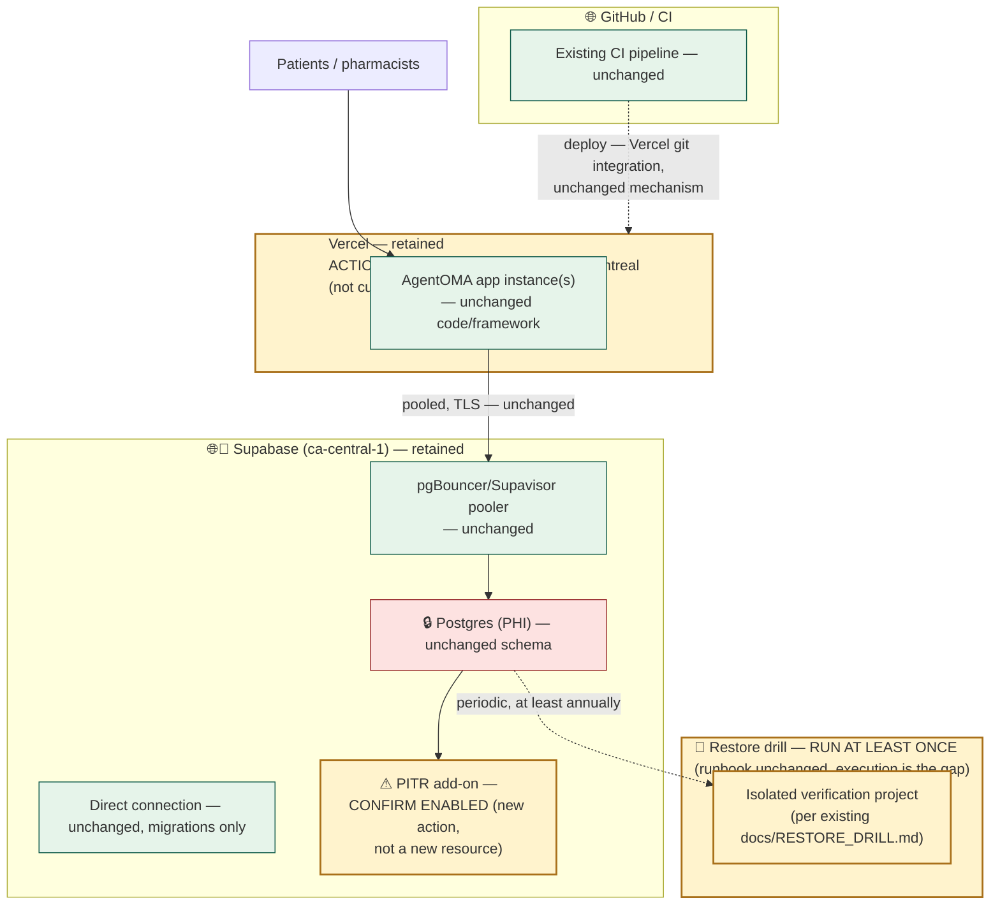

# AgentOMA — Target Architecture (Workstream 4, item 10)

**Nature:** proposal only. Nothing in this document is applied. It describes where the evidence
in [`SYSTEM-DESIGN-REVIEW.md`](SYSTEM-DESIGN-REVIEW.md) and
[`DATABASE-AND-HOSTING-COMPARISON.md`](DATABASE-AND-HOSTING-COMPARISON.md) points, not a
committed plan.

## Summary of the target

The evidence-based conclusion of this review is that **the current data platform (Supabase) and
current hosting platform (Vercel, confirmed by the product owner) should both be retained** —
this is not a "no changes" report, though. Several concrete, low-risk deltas from today's
architecture are recommended, none of which involve replacing the database or hosting vendor:

1. **Confirm and, if needed, enable Supabase PITR** — currently unconfirmed from repository
   evidence, separately billed, and directly relevant to the stated ten-year retention
   requirement.
2. **Explicitly pin Vercel function execution to the Montréal region (`yul1`)** — Vercel's
   default is US-based; this is not automatic and nothing in the repo confirms it's already set.
3. **Execute the backup/restore drill at least once** — the runbook exists in full
   (`docs/RESTORE_DRILL.md`) and has never been run. This is the single clearest gap this review
   found, independent of any vendor question.
4. **Decide, with privacy/legal input, whether Vercel's $350/mo BAA add-on is needed.**
5. **No change to the database schema, ORM, migration tooling, or auth provider** — Drizzle,
   file-based migrations, and better-auth all remain appropriate.

## Diagram 10 — proposed target architecture

The visual difference from diagram 3 (current-state deployment) is deliberately small: the boxes
marked 🟨 (amber) are *actions to confirm/execute*, not new infrastructure to build. This is the
honest shape of an evidence-based "stay with current stack" recommendation — it is not a
do-nothing conclusion, but the changes are operational verification, one configuration setting,
and one unexecuted runbook, not new vendors.

## What this target explicitly does not include

- No new database vendor.
- No new hosting vendor.
- No new background-job/queue infrastructure — none is currently needed; §6 of the system review
  found no async workload today that would justify one. If Rx/referral document storage
  (Supabase Storage, already planned) introduces a dual-write consistency problem in the future
  (flagged in the system review's risk table), that would be a separate, future architectural
  decision, not part of this target.
- No change to the auth provider (better-auth stays; no migration to Supabase Auth or another
  identity provider is proposed).
- No observability tooling is added here, despite being a real gap (system review §11) — adding
  Sentry/structured logging is a legitimate follow-on recommendation but is an implementation
  decision outside this review's synthetic/design-only scope, and would need its own
  privacy review given it would touch what appears in error telemetry for a PHI system.

---

## Required recommendation format

**Recommended database:** Supabase PostgreSQL (`ca-central-1`) — retain. See ADR-001.

**Recommended application host:** Vercel — retain, with explicit Canadian region pinning. See
ADR-002.

**Recommended deployment topology:** unchanged from today — single-region Canadian hosting
(Vercel, pinned to `yul1`), single-region Canadian Supabase Postgres, pooled runtime connection /
direct migration connection, no multi-region or active-active topology recommended at current
single-pharmacy pilot scale.

**What should remain unchanged:** database vendor, hosting vendor, ORM (Drizzle), migration
tooling (file-based, `db:generate`/`db:migrate`, `db:push` banned), auth provider (better-auth),
route-group architecture, the two-layer auth boundary (`proxy.ts` optimistic gate +
`requirePortalUser()` authoritative recheck), the sandbox isolation mechanism, and the CI job
structure.

**What should change now (no migration, no cost, no new vendor):**
1. Confirm whether Supabase PITR is enabled; enable it if not.
2. Explicitly pin Vercel function execution region to Montréal (`yul1`).
3. Execute the backup/restore drill at least once and record the evidence, per the existing
   runbook.
4. Add hosting-platform information to `docs/PROJECT_OVERVIEW.md`'s technology table — its
   current absence is what made this an open question in the first place.

**What should wait until production scale:** re-evaluating CMK/customer-managed encryption keys
(Azure and GCP both offer this natively today; Supabase does not outside enterprise sales) and
re-evaluating whether better-auth's tables should be separated from the PHI database (tight
coupling flagged in the system review) — both are legitimate future questions, neither is
justified by current single-pharmacy pilot scale or any proven capacity/compliance pressure.

**Migration sequence, if any:** none recommended at this time. If a future re-evaluation
concludes a database or hosting migration is warranted, the sequence would follow standard
`pg_dump`/logical replication to the new database provider (or a standard container-based
re-platforming for hosting), replay of the existing file-based migration history to reconstruct
triggers/privileges/constraints (the same discipline already in use), a Task 11-reviewed cutover
window, and a verified restore-drill against the new provider before decommissioning the old one.
No part of this sequence is scheduled or approved by this document.

**Estimated complexity and major risks:** the recommended near-term actions are low-complexity
(a support-ticket-level configuration confirmation, one config-file change, one runbook
execution) with low risk. The risk this review is most concerned about is *not* doing item 3
above (executing the restore drill) — an unexercised recovery procedure is the least reversible
kind of gap, since it can only be discovered as broken during a real incident.

**Rollback strategy:** none of the near-term recommended actions require a rollback plan beyond
what already exists — enabling PITR and pinning a region are both reversible platform settings;
running a restore drill is explicitly designed (per its own runbook) to never touch production.

**Open decisions requiring human approval:**
- Whether to enable/pay for Supabase PITR (cost decision).
- Whether Vercel's $350/mo BAA add-on is required (privacy/legal decision).
- Scheduling and resourcing the first restore drill (operational decision, owner already named in
  the existing runbook: "Pharmacy privacy/security lead").
- Whether to proceed with the synthetic PoC described in `POC-PLAN.md` (explicit Product Lead +
  Security/Privacy approval required per the task brief — not decided by this document).
- Approval to actually apply the region-pin configuration change and to document the confirmed
  hosting platform in `docs/PROJECT_OVERVIEW.md` (both are still deployment/documentation changes
  requiring sign-off, even though neither changes vendor).

**Confidence level and evidence limitations:** high confidence in the database and hosting
*comparisons* (Part A/B of `DATABASE-AND-HOSTING-COMPARISON.md`) — every claim is sourced to
current official vendor documentation with a checked date, and the hosting platform itself is now
confirmed rather than inferred. Lower confidence remains in two specific areas, both disclosed at
the point they occur rather than smoothed over: (1) the exact maximum PITR window for Google
Cloud SQL's enhanced backups could not be confirmed from the page fetched during research; (2)
Azure Container Apps' Canada East regional availability was inconsistently documented and should
be re-verified directly before being relied on. Neither gap affects the "stay with current stack"
recommendation, since both were only relevant to migration alternatives that weren't selected.
