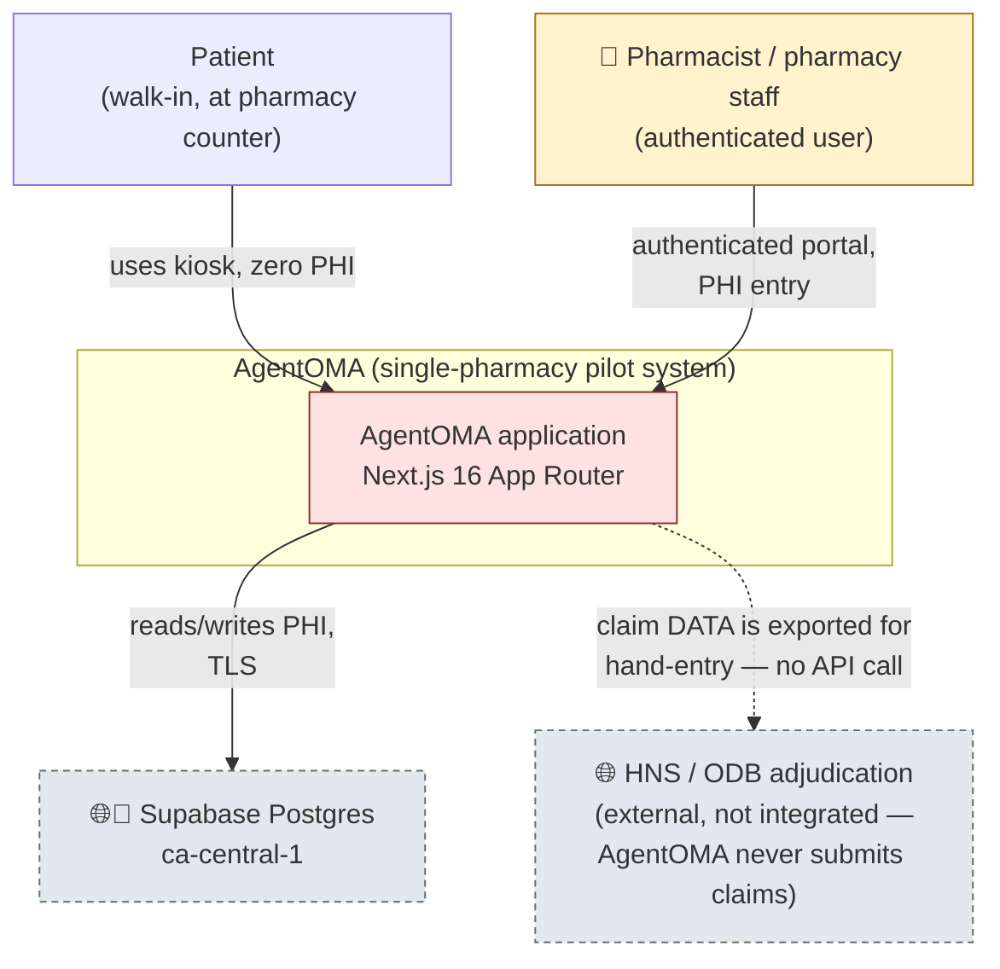
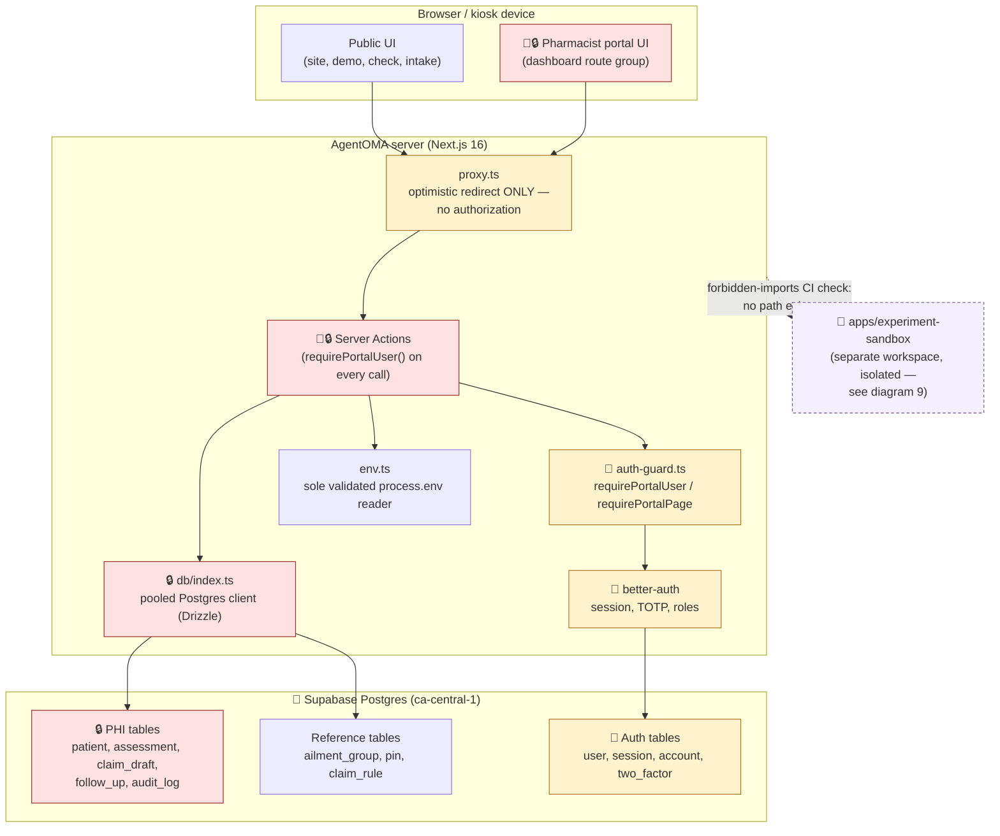
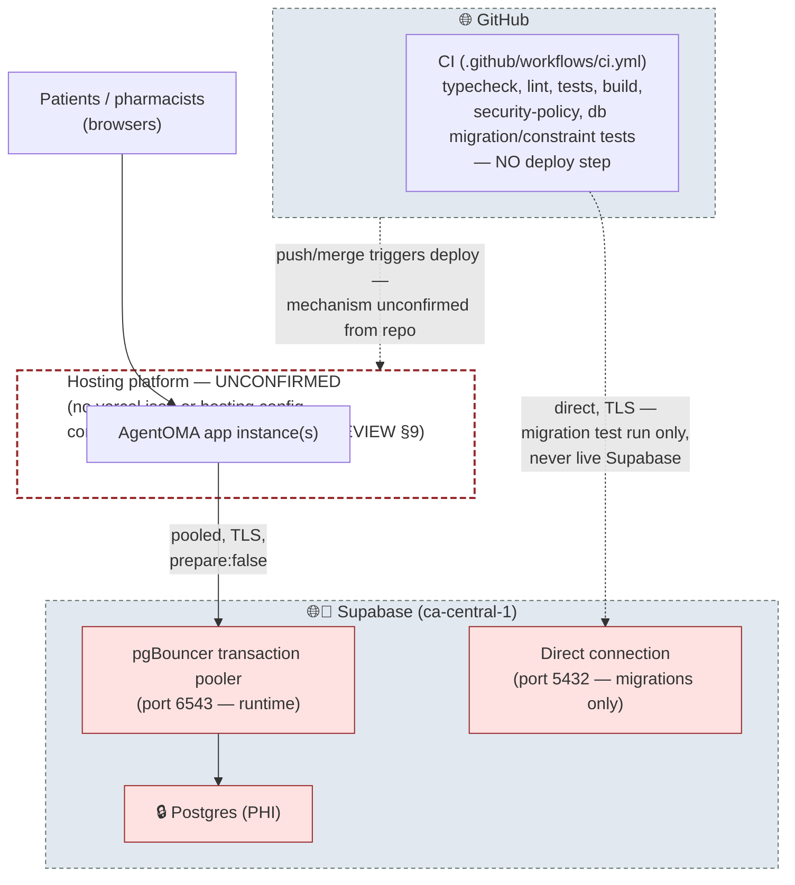
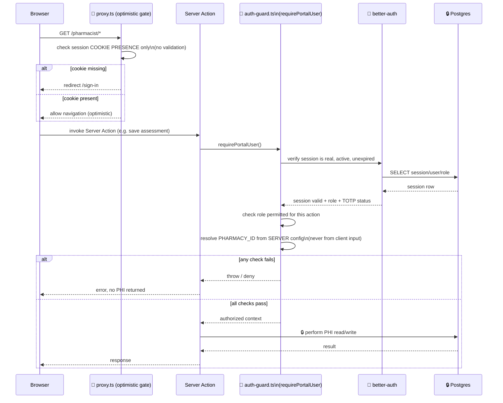
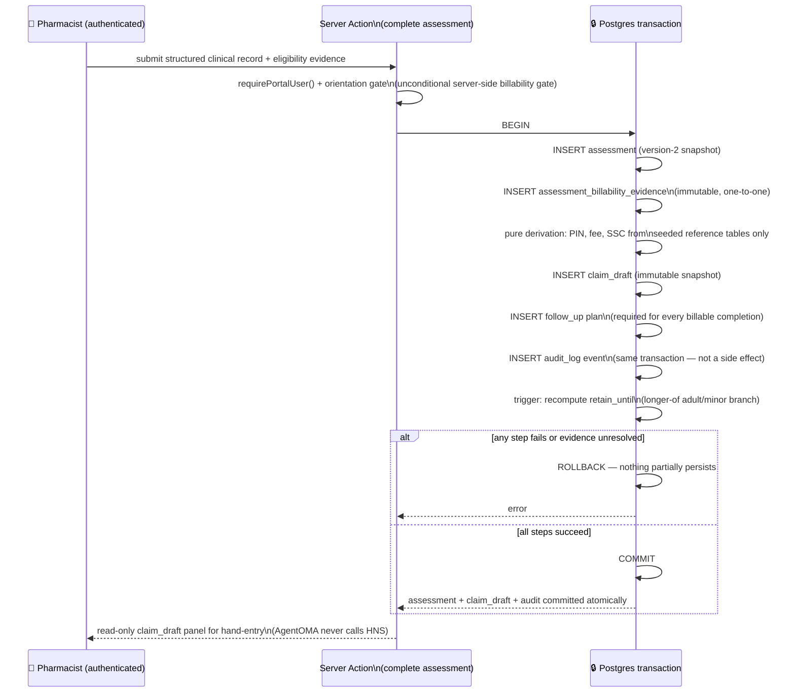
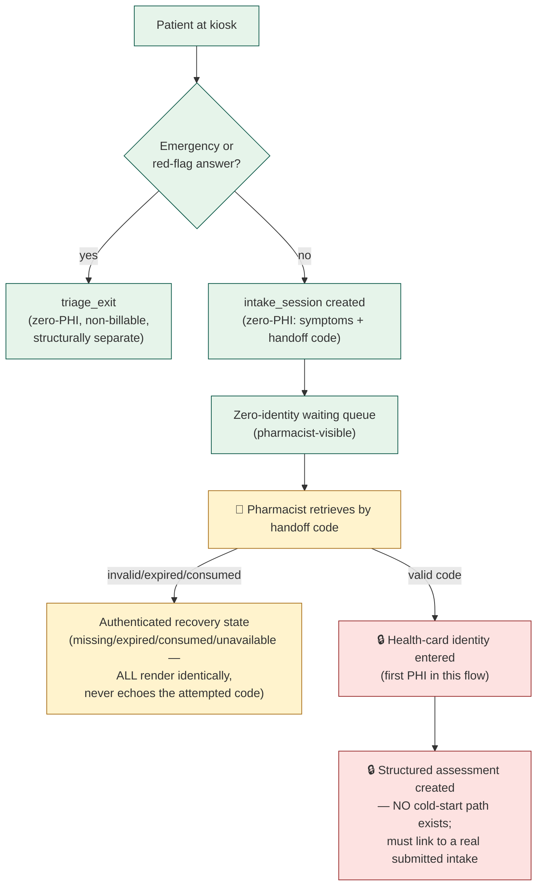
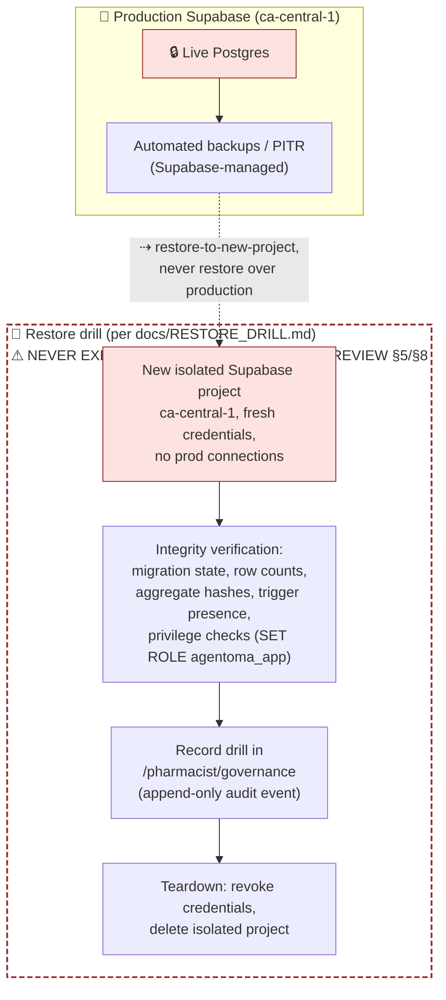
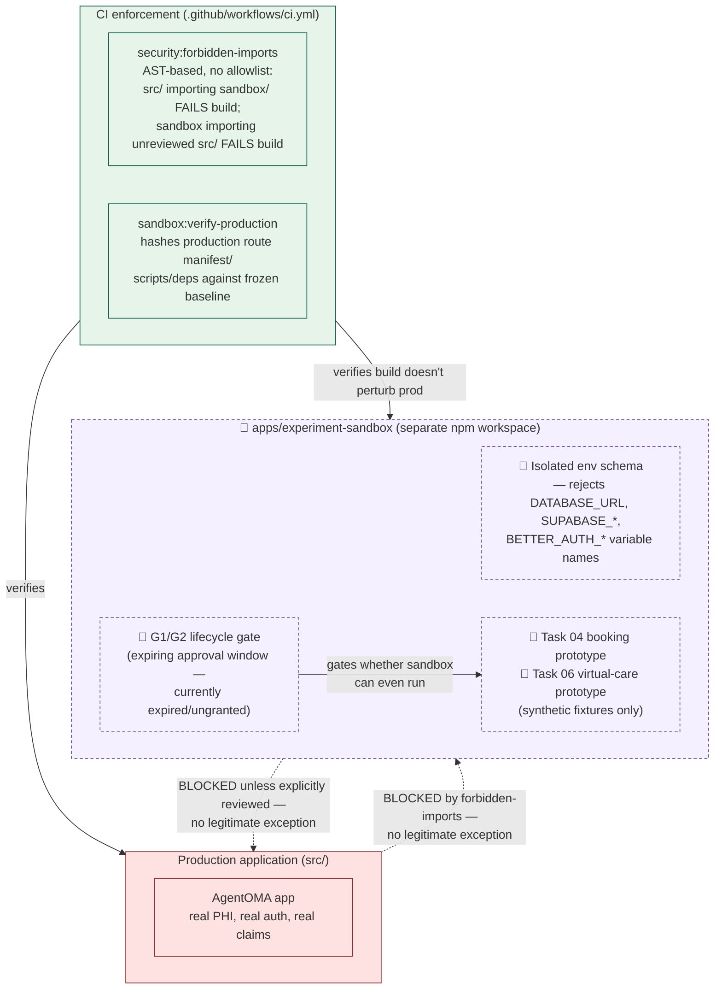

# AgentOMA — System Design Diagrams (Workstream 4)

**Nature:** documentation only. These diagrams describe the *current* system (items 1–9) as
verified in [`../SYSTEM-DESIGN-REVIEW.md`](../SYSTEM-DESIGN-REVIEW.md). The proposed target
architecture (item 10) lives in [`../TARGET-ARCHITECTURE.md`](../TARGET-ARCHITECTURE.md) since it
is tightly coupled to that document's recommendation narrative, not reproduced here.

**Labeling convention used throughout:** since Mermaid has no native "boundary label" primitive,
every diagram below uses a consistent visual/textual convention instead of prose annotation:

- 🔒 **PHI boundary** — nodes/subgraphs handling PHI are prefixed `🔒` and styled `fill:#fde2e1`.
- 🔑 **Authentication boundary** — nodes enforcing or checking identity are prefixed `🔑` and
  styled `fill:#fff3cd`.
- 🍁 **Canadian-region requirement** — infrastructure that must stay in Canada is prefixed `🍁`.
- 🌐 **External system** — anything outside AgentOMA's own deployment is styled `fill:#e2e8f0`
  with a dashed border.
- ⇢ **Trust transition** — an edge crossing from a lower-trust to higher-trust context (or
  vice versa) is drawn as a dashed arrow (`-.->`) instead of a solid one.
- 🧪 **Synthetic/sandbox component** — anything inside `apps/experiment-sandbox/` is prefixed
  `🧪` and styled `fill:#f5f0ff`, to keep it visually distinct from production (unprefixed).

---

## 1. C4 system-context diagram

## 2. Container / component diagram

## 3. Production deployment diagram

## 4. PHI data-flow and trust-boundary diagram

```mermaid
flowchart LR
  subgraph zeroPhi["Zero-PHI zone"]
    kiosk["Patient kiosk\n/assessment"]
    intakeSession["intake_session row\n(symptom + handoff code only)"]
  end

  subgraph handoff["Trust transition point"]
    code["6-character handoff code\nshort-lived, single-use"]
  end

  subgraph phiZone["🔒 PHI zone (authenticated only)"]
    pharmacistUi["🔑 Pharmacist portal"]
    identity["Health-card identity entry"]
    clinicalRecord["Clinical record, consent,\nprescription"]
    billing["🔒 claim_draft\n(export only, never submitted)"]
    audit["🔒 audit_log\n(append-only)"]
  end

  kiosk --> intakeSession --> code
  code -.->|"⇢ trust transition:\nzero-PHI to PHI"| pharmacistUi
  pharmacistUi --> identity --> clinicalRecord --> billing
  clinicalRecord --> audit
  billing --> audit

  classDef nophi fill:#e6f4ea,stroke:#0e5a4a
  classDef phi fill:#fde2e1,stroke:#97292a
  classDef trans fill:#fff3cd,stroke:#a9701a
  class kiosk,intakeSession nophi
  class code trans
  class pharmacistUi,identity,clinicalRecord,billing,audit phi
```

## 5. Authentication and authorization sequence

## 6. Assessment → evidence → claim draft → audit transaction

## 7. Patient intake and pharmacist handoff

## 8. Backup, restore, and disaster-recovery flow

## 9. Experimental-sandbox isolation boundary

---

## Cross-references

Every node and boundary above traces to a specific, cited finding in
[`../SYSTEM-DESIGN-REVIEW.md`](../SYSTEM-DESIGN-REVIEW.md) — no new architectural claim is
introduced here that wasn't already verified there. Diagram 3 (deployment) deliberately renders
the hosting platform as unconfirmed rather than guessing, consistent with §9 of that document.
Diagram 10 (proposed target architecture) is in
[`../TARGET-ARCHITECTURE.md`](../TARGET-ARCHITECTURE.md).
