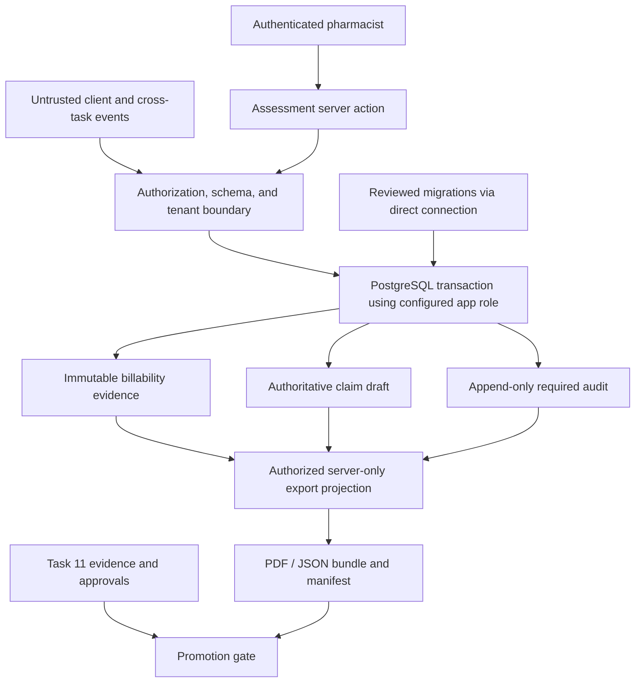

# Task 02 threat model

**Scope:** pharmacist assessment completion, immutable P0-C evidence, claim
draft, audit, authorized retrieval/export, migration 0018, and release evidence.  
**Date:** 2026-08-02  
**Data used to prepare this model:** repository structure and synthetic-safe
metadata only; no live rows or credentials.

## Assets and trust boundaries

Protected assets are patient/assessment PHI, pharmacy isolation, pharmacist
authority, migration identity/history, billability evidence, claim drafts,
audit records, seeded reference integrity, exported records/hashes, database
credentials, backups, and release evidence.

Client values, cross-task events, experimental modules, and external systems
must stop at the server authorization/schema boundary. They have no direct
edge to evidence, claims, audits, migration state, or release approval.

## Threat cases

| Threat / source | Prevention | Detection and evidence | Response | Residual risk/status |
|---|---|---|---|---|
| Wrong-environment migration | Exact G1 gate binds commit/hash/environment; direct URL only; no manual SQL | Target identity and migration hash precheck | Stop before mutation; revoke stale approval | **BLOCKED:** no G1-L/current target evidence |
| Approval/hash drift | Recompute full SHA and chain digest immediately before action | Baseline + evidence manifest comparison | Treat as unapproved; regenerate review | Candidate commit not frozen yet |
| Partial migration | Drizzle pending migrations execute in a transaction | Induced Docker rollback, history/catalog check after restart | Do not retry ambiguous live result; escalate | Runtime proof requires G1-D |
| Cross-tenant evidence injection | Server-only configured pharmacy; composite assessment/pharmacy FK | Negative DB/application tests | Refuse without existence disclosure | Static PASS; runtime proof pending |
| Server-auth/RLS bypass | `requirePortalUser`; no client tenant authority; non-owner app role | Wrong actor/session tests, role/catalog proof | Deny and audit safe event | RLS is not used; app-role identity needs verification |
| Evidence/audit mutation | Trigger + app-role revoke; append-only application paths | App-role UPDATE/DELETE/TRUNCATE and trigger-bypass tests | Block promotion; incident review | Runtime proof pending |
| Parent cascade deletes evidence | Evidence trigger permits only transaction-marked reviewed destruction | Ordinary cascade refusal and governed-destruction tests | Stop destructive workflow | Runtime proof pending |
| `SECURITY DEFINER` escalation | Reviewed governance function revokes PUBLIC and performs policy checks | Function ownership/search-path/grant catalog plus unauthorized execution tests | Revoke execution / forward-fix under approval | Earlier migration surface; runtime proof pending |
| Partial assessment/evidence/claim commit | One DB transaction for assessment/evidence/claim/follow-up | Deterministic fault injection after each stage | Roll back and return safe refusal | **FAIL:** assessment-created audit is outside transaction |
| Duplicate/retry/race claim | Advisory locks, unique/constraint-backed rules, immutable active draft model | Real-Postgres retry/concurrency tests | Safe duplicate outcome; reconcile | 0018 rerun pending |
| Red-flag/referral confusion | Separate terminal triage path; defensive claim refusal; five outcomes retained | Zero-row and completed-referral tests | No claim; pharmacist referral path | Existing tests only; fresh proof pending |
| Hardcoded/stale billing mapping | Seeded reference lookup injected into pure derivation; unknown refuses | Forbidden-hardcode scan and money-rule tests | Block claim/export; configuration incident | Protected derivation unchanged |
| Orientation bypass | Intended server gate before transaction | Missing-orientation negative test | Refuse before derivation | **FAIL:** admin override currently enables completion without G3 |
| Unsafe LTC claim | Every LTC fact combination currently refuses claim derivation | Pure refusal and DB zero-claim tests | Record clinical assessment only; escalate to ODB Help Desk | Parked by G2, safe behavior intended |
| Unauthorized export | Route and query revalidate session/role/pharmacy; server-only PHI rendering | Unauthorized/revoked/cross-tenant tests | Generic 401/404; safe audit failure record | Workstream F DB proof pending |
| Manifest/artifact tampering | Canonical SHA-256 stored in server manifest | Compare retained manifest to exact bundle/artifacts | Reject artifact and investigate | **BLOCKED(S27):** repeat/canonical contract and reconstruction verifier unresolved |
| PHI/secret leakage | No payload logging; generic filenames; private/no-store; synthetic evidence | Source scans, failure-log test, artifact scans | Remove/quarantine artifact; privacy process if real data | Static/pure checks pending final scan |
| Test hook/fixture in production | Local endpoint guard, loopback Docker, no production fixture imports | Forbidden-import/build scan | Fail build/promotion | Local guard improved; Docker proof pending |
| Backup cannot restore | Require identified restore point and prior drill before live apply | Restore evidence and isolated drill | Stop S17; no live apply | **BLOCKED:** evidence/owner not supplied |
| Cross-task event creates clinical effect | No roadmap task may call completion/claim authority directly | Import/effect-reachability tests | Deny unknown source/action | Task 11 registration/review pending |
| Over-privileged insider/support role | Least-privilege app role, admin-only export, immutable records | Role grants, access/export audits, review | Revoke session/role; investigate | Connection role and operational review pending |

## Safe evidence and logging rules

Evidence may contain hashes, counts, object names already defined in the
repository, safe PostgreSQL error codes, commands without secrets, timestamps,
and status. It must not contain row contents, patient/staff identifiers,
clinical text, claim contents, URLs/credentials, request bodies, or raw SQL
errors. Synthetic negative probes must be unmistakably synthetic.

## Release consequence

Two required controls are statically false: required assessment audit is not
failure-atomic, and orientation can be overridden without G3. Task 02 cannot
promote while either remains. The threat model itself does not authorize fixes,
database execution, or production deployment.
