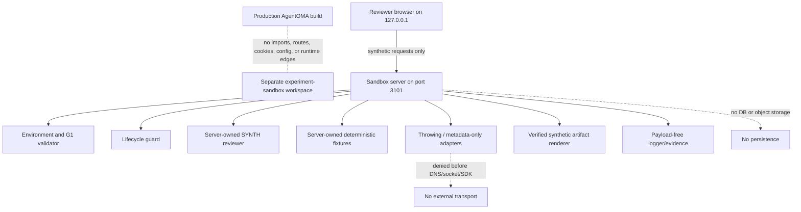
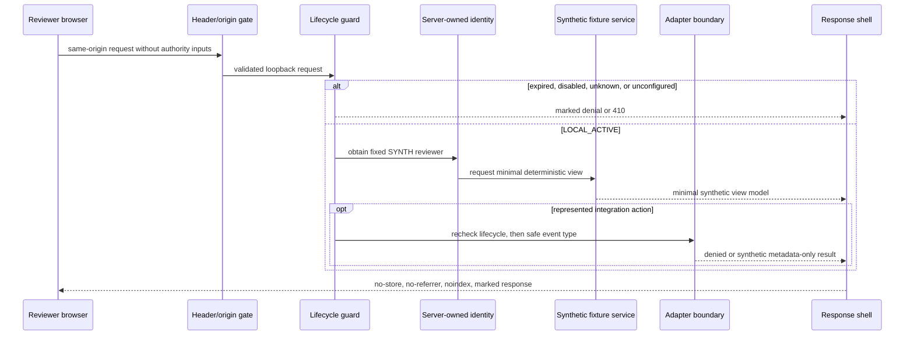
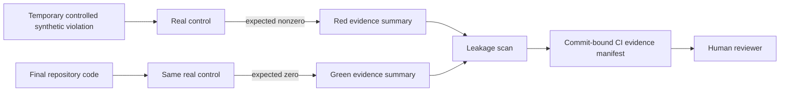
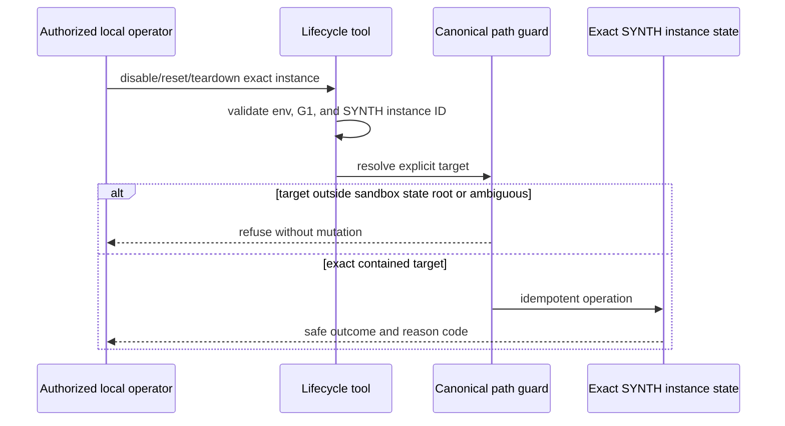

# Task 01 experimental sandbox data flow

**Version:** proposed G1 data flow, 2026-07-31
**Status:** G1 GRANTED; implementation evidence in progress
**Initial hosting:** loopback only
**Initial persistence:** none
**Initial external destinations:** none

## System context



The production and sandbox builds share only npm installation infrastructure.
They share no application source, environment module, route, identity,
database, fixture, integration, artifact renderer, or runtime state.

## Startup flow

```mermaid
sequenceDiagram
    participant O as Local operator
    participant W as Allowlisted command wrapper
    participant E as Sandbox env validator
    participant N as Egress-denial preload
    participant S as Next sandbox server

    O->>W: sandbox command plus required SANDBOX_* values
    W->>W: discard non-allowlisted parent environment
    W->>E: validate required values and prohibited classes
    alt invalid, expired, disabled, production-like, or hosted
        E-->>O: safe reason code; no server starts
    else valid local synthetic state with G1
        W->>N: install outbound transport denial
        N->>S: start separate build/server on 127.0.0.1:3101
        S->>E: revalidate at server initialization
    end
```

No adapter, fixture, Next route, or renderer initializes before environment and
approval validation.

## Request flow



Client query, body, header, cookie, role, actor, pharmacy, and capability values
do not select authority or fixtures.

## Artifact flow

```mermaid
sequenceDiagram
    participant B as Reviewer
    participant L as Lifecycle guard
    participant G as Synthetic artifact generator
    participant V as Watermark verifier
    participant O as HTTP response

    B->>L: request generic sample artifact
    L->>G: active instance and server-owned sample model
    G->>V: deterministic two-page bytes
    alt watermark or metadata invalid
        V-->>O: marked generic refusal; discard bytes
    else every page verified
        V-->>O: SYNTHETIC-NOT-FOR-CARE-* download
    end
```

The generator does not accept a patient record, clinical content, claim value,
identifier, filename, or arbitrary free text.

## Evidence flow



Red fixtures exist only in memory or an operating-system temporary directory.
Evidence contains command, exit code, hash, control ID, timestamp, and safe
reason—not the tested body, rejected value, fixture content, environment value,
or resource name.

## Disable and teardown flow



There is no remote target, wildcard, unresolved variable, arbitrary path,
production database, storage bucket, user, session, or deployment resource.

## Data inventory

| Data | Source | Location | Retention | Client exposure |
|---|---|---|---|---|
| Sandbox config | Operator/CI synthetic sentinels | Process memory | Process lifetime | Safe banner/expiry presentation only |
| G1 decision ID | Version-controlled approval record | Source/build metadata | Repository history | May show non-sensitive reference |
| Lifecycle state | Server/tool | Exact local `.sandbox-state/SYNTH-*` path | Until reset/teardown | Status only |
| Synthetic actor | Server-owned constant | Server memory | Process lifetime | Minimal label only |
| Fixture corpus | Deterministic server module | Server memory | Process lifetime | Minimal selected view model |
| Adapter event | Throwing/in-memory adapter | Server memory | Process lifetime | Safe outcome only |
| Artifact | Deterministic server renderer | Response memory | Download only | Fully marked sample |
| Log/evidence record | Closed logger/evidence tool | Console/CI artifact | Task evidence policy | Safe metadata only |

## Current G1 implementation

The implementation follows this model: the sandbox uses only synthetic
sentinels, stores lifecycle state under the contained local `.sandbox-state/`
directory, denies external transport, and emits only allowlisted operational
metadata. No production data, credential, database, object storage, analytics,
or external provider is in the flow.

## Explicitly absent flows

There is no flow to:

- production `.env`, Supabase, Postgres, object storage, better-auth, TOTP, or
  production cookies;
- HNS, FHIR, dispensing, clinical viewer, email, SMS, push, payment, courier,
  calendar, video, model, analytics, telemetry, replay, or error reporting;
- production `src/` modules, seeds, routes, exports, audit, retention, or
  migration code;
- real, copied, de-identified, pseudonymized, or realistically shaped records;
- browser storage, service workers, external assets, source maps, or indexed
  pages; or
- hosted preview, production domain, tunnel, LAN listener, or named external
  reviewer before G2.

## Boundary verification

| Boundary | Planned proof |
|---|---|
| Production → sandbox | Production import scan plus route/bundle/NFT/config/deployment invariance |
| Sandbox → production | Root-contained dependency graph with empty G3 allowlist |
| Parent environment → sandbox | Allowlisted process spawn and prohibited-variable tests |
| Browser → authority | Client-tampering tests; server-owned actor |
| Server → network | Preload denial and DNS/socket spies |
| Browser → network/storage | CSP, request inspection, storage/history/console tests |
| Fixture → client | Client-bundle canary exclusion |
| Renderer → download | Per-page watermark/metadata verification |
| Tool → filesystem | Canonical target containment and idempotency tests |
| Test → evidence | Red/green pair, leakage scan, hash, and commit-bound manifest |

## Unapproved future flows

The following require a revised design and approval:

- any database or file/object persistence;
- any production-module import under G3;
- any non-loopback preview under G2;
- any hosted identity provider;
- any external destination or provider SDK;
- any patient/pharmacist/pharmacy-shaped fixture;
- any artifact resembling an operational form; and
- any model or AI request.
