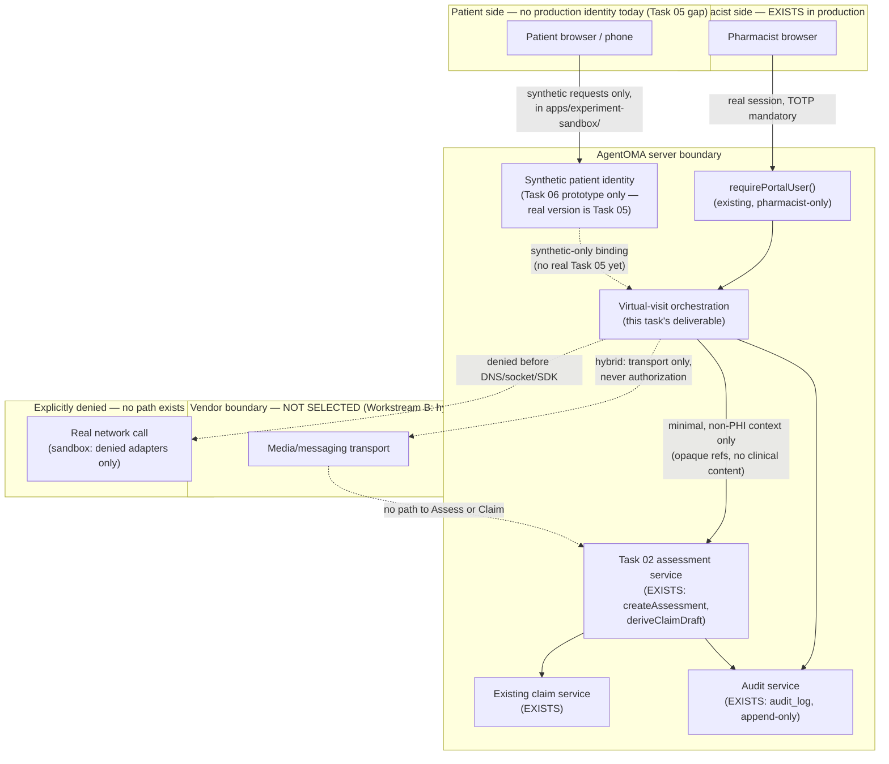
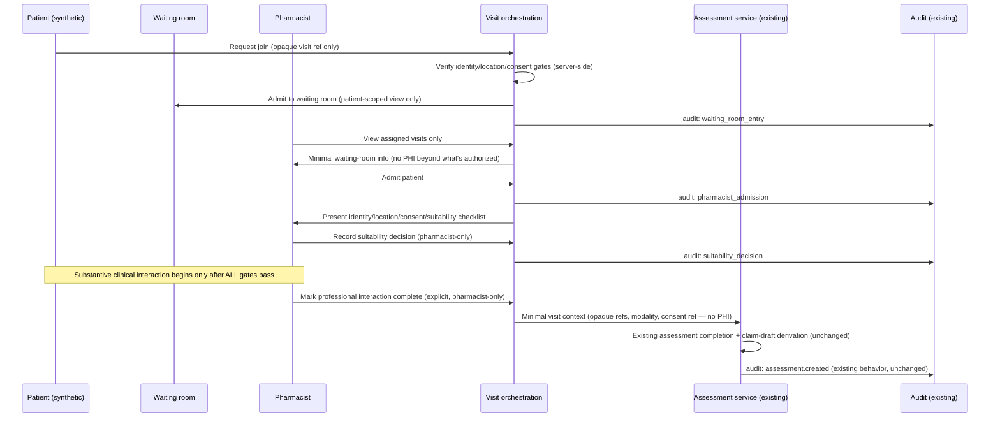
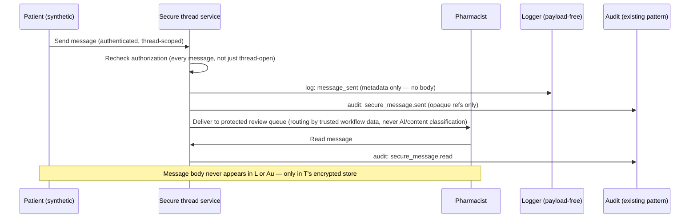

# Task 06 — Trust Boundaries and Data Flows

Diagrams are descriptive, not proof — the architecture/authorization/state-transition tests
(Workstream L/M) are what actually enforce every boundary drawn here, per this task's own
instruction.

## 1. Trust boundaries (target design)

**Key boundary properties this diagram encodes:**

- The vendor box has **no arrow into Assess or Claim** — matching the non-negotiable invariant
  that a vendor event can never itself complete an assessment or create a claim.
- `PatIdentity` is drawn as synthetic-only with a dashed line into `Visit`, because there is no
  real patient identity to bind to yet (Task 05 gap) — production readiness requires that
  dashed line to become a real Task 05 integration, not requires this task to fake one.
- `Auth` (existing `requirePortalUser`) is reused unchanged for the pharmacist side; Task 06
  does not introduce a second pharmacist authorization path.

## 2. Data flow — visit lifecycle (target design, synthetic in this task)

**What this flow deliberately does NOT show:** any path from "disconnect," "timeout," or
"vendor webhook" to the `A->>A` completion step — because no such path exists in the design.
Those events only ever reach the *connection/interruption* state dimension (see the state-model
deliverable), never the completion action directly.

## 3. Secure-messaging data flow (target design, synthetic in this task)

## 4. What crosses each boundary (summary table)

| Boundary crossed | What's allowed to cross | What's explicitly forbidden |
|---|---|---|
| Patient browser → AgentOMA server | Opaque visit reference, structured gate-check answers, message text (bounded/sanitized) | Raw identity documents, exact GPS, any client-asserted role/subject/pharmacy value |
| AgentOMA server → Vendor (hybrid) | Encrypted destination, minimal routing config, provider idempotency key | Patient/subject/pharmacy/appointment/assessment/thread identifiers, clinical content |
| Vendor → AgentOMA server (webhook) | Safe event type, outcome, provider reference | Anything treated as authoritative for assessment/claim/consent/suitability state |
| Visit orchestration → Assessment service (existing) | Opaque visit ref, approved modality, suitability/consent/identity/location *references* (not content), safe technical-failure status, timestamps | Any clinical content, any raw consent/location detail |
| Any service → Logs/audit | Safe event type, opaque references, outcome, safe reason code | PHI, tokens, message bodies, secrets, exact location, raw SDP/ICE/TURN |

## 5. Residual gap this diagram cannot close

Every "synthetic-only" and "not selected" label above is a real, currently-open dependency —
this diagram documents the *target* trust model the prototype will implement and test; it is
not evidence that the production version of any dashed/vendor box exists yet.
