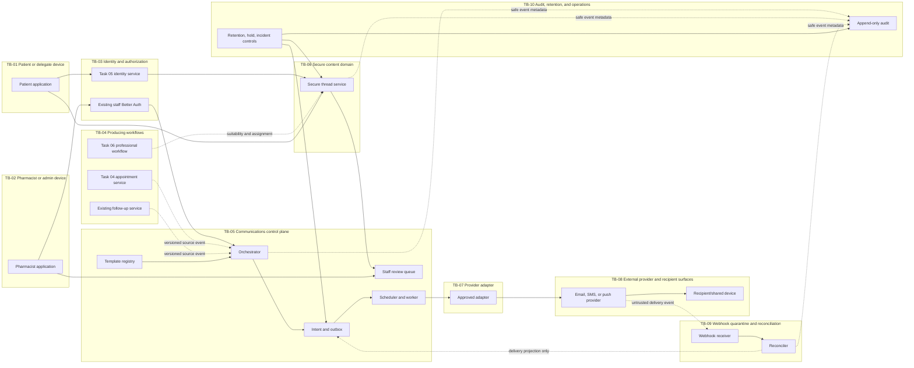
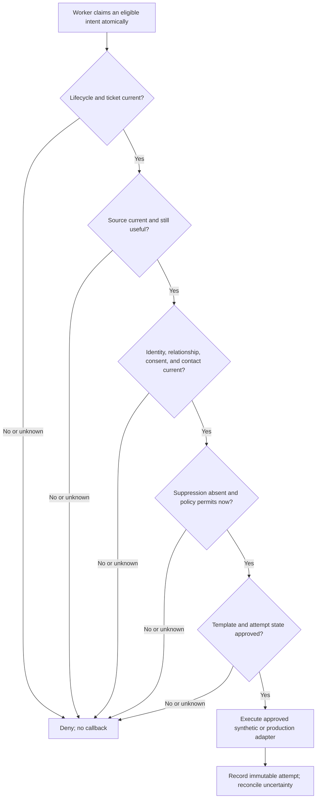
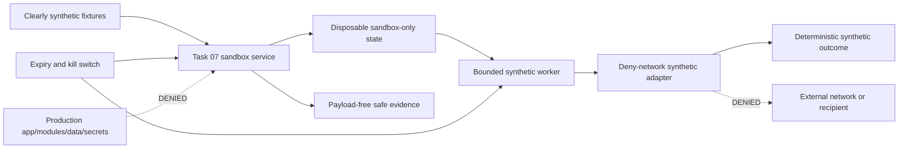

# Task 07 — Trust Boundaries and Data Flows

**Workstream:** B — threat model, trust boundaries, and data flows

**Prepared:** 2026-08-06

**Repository design baseline:** `df33afd9c01f2659bde743734fd5fee729947f49`

**Implementation status:** conceptual only; no endpoint, schema, provider,
credential, worker, recipient, or network effect exists

## Purpose and limits

This document defines the boundaries a future communications system must not
cross implicitly. It is a design contract for review, not authority to implement
or deploy. The current repository has no integrated patient identity, verified
contact/communications consent, appointment producer, outbox worker, provider,
webhook, or secure patient thread.

The design therefore uses proposed component names to describe ownership. It does
not invent production roles, URLs, vendors, consent wording, retention periods,
message copy, or provider semantics. Those unresolved inputs remain in
[`production-dependency-register.md`](production-dependency-register.md).

## Boundary invariants

1. A clinical patient record is a subject, not an authenticated actor.
2. Contact possession or contact verification is not patient identity or
   actor-to-subject authority.
3. Client input is never authoritative for pharmacy, actor, subject, delegate,
   recipient, channel, purpose, template, source state, consent, or suppression.
4. Creating or scheduling an intent is not authority to dispatch later.
5. The worker re-reads every relevant current version immediately before the
   synthetic or approved provider effect. Unknown, stale, expired, revoked,
   superseded, disputed, mismatched, or contradictory state denies.
6. No channel fallback occurs without separate, current authority for that
   channel and a newly evaluated intent.
7. External email/SMS/push is generic and contains no PHI or identifying URL.
8. Secure-message content stays inside the authenticated portal/content boundary.
9. Provider/webhook events describe delivery only. They cannot become clinical,
   appointment, follow-up, visit, prescription, referral, or billing commands.
10. Suppression, kill switches, lifecycle expiry, and source cancellation take
    precedence over convenience, retry, cadence, and queued work.
11. Queue, audit, logs, telemetry, evidence, URLs, and provider metadata contain
    only allowlisted safe metadata, never content, contact values, tokens, or PHI.
12. The Task 01 sandbox is a separate application with synthetic fixtures and
    denied egress. Production cannot import it, and it cannot import production
    modules without an explicit G3 decision. G3 is currently empty.

## Data classes

| Class | Examples | Permitted locations | Forbidden locations |
|---|---|---|---|
| C0 — public generic | Approved neutral notice text with no relationship detail | Approved external body, public static assets | May not gain dynamic patient/clinical placeholders. |
| C1 — safe operational metadata | Opaque internal ID, channel enum, safe status/reason code, template version, timestamps | Server, database, minimized audit/queue/metrics | Public URL, external body, client data unless needed for the current view. |
| C2 — identity/authorization metadata | Actor/subject/grant IDs, pharmacy ID, consent/contact versions, assignments | Server and approved Canadian-region database; minimum necessary protected UI | Provider tags, logs, analytics, evidence, unauthenticated client. |
| C3 — direct contact/secret-like identifiers | Email, phone, normalized match, device token, verification challenge, provider reference | Encrypted server storage and narrow adapter memory only | URLs, logs, audit, analytics, queue labels, evidence, support tickets, browser persistence. |
| C4 — PHI/secure content | Message body, ailment/medication/appointment purpose, clinical reply, patient name/health number | Authenticated secure portal/content store in approved Canadian region | Email/SMS/push preview or body, provider metadata, logs, audit body, general queue, public client. |
| C5 — credentials | Provider/API keys, webhook secrets, signing keys | Approved secret store and bounded server process memory | Database business rows, client bundle, logs, evidence, docs, provider metadata. |
| S0 — synthetic-only | Clearly implausible actors, contacts, events, provider outcomes | Task 01 sandbox and synthetic evidence | Production database, live provider, real recipient, production import path. |

## System context

Solid arrows below are conceptual allowed flows after their gates are approved.
Dashed arrows are observations or receipts, never authority to complete source
work.



No arrow from provider, webhook, secure thread, or queue points to clinical or
billing completion. That absence is intentional and must be enforced by module,
database-role, and architecture tests.

## Trust-boundary inventory

| ID | Boundary | Trust entering boundary | Required validation and minimization | Failure behavior |
|---|---|---|---|---|
| TB-01 | Patient/delegate browser or device | Untrusted input; device may be shared or compromised. | Task 05 session audience, actor-subject grant, origin/CSRF, schema/size validation, no browser persistence, no sensitive URL. | Generic denial; clear sensitive state; never reveal object existence. |
| TB-02 | Pharmacist/admin browser | Authenticated but still untrusted client input. | Server rechecks staff session, active role, pharmacy scope, orientation where clinical action requires it, and action schema. | Deny server-side; `proxy.ts` remains UX only. |
| TB-03 | Identity/authorization services | Identity assertions are trusted only for their exact audience/version. | Session revocation, relationship version/expiry/scope, actor versus subject, staff/patient audience separation. | Unknown or stale assertion denies. |
| TB-04 | Producing workflows | Source event is trusted only from its authoritative service and current version. | Opaque reference, source type/version/state/useful-until, cancellation/supersession, pharmacy match. | No intent or stale-intent cancellation; producer state is never modified. |
| TB-05 | Communications control plane | Orchestrator accepts only authenticated internal source events/actions. | Derive authority server-side; immutable intent; exact purpose/channel/template/contact/consent versions; idempotency. | Transaction rolls back or records safe denial; no partial intent/audit state. |
| TB-06 | Secure content domain | Content is untrusted PHI-bearing input. | Participant/assignment/suitability on every request, length/content/link rules, no attachments, no external preview, encryption/no-store. | Reject or quarantine; no body copied to logs/audit/general queue. |
| TB-07 | Provider adapter | Last internal point before an external effect. | Final lifecycle/source/identity/consent/contact/suppression/template check, approved adapter capability, idempotency, generic payload allowlist. | Fail closed; synthetic adapter returns deterministic local outcome only. |
| TB-08 | External provider/recipient/shared surfaces | Fully external and potentially outside pharmacy control. | Minimum generic C0 body, minimal C1 metadata, approved contract/region/support/subprocessors, no sensitive link. | Kill/suppress/quarantine; incident process for wrong recipient/provider compromise. |
| TB-09 | Public webhook/inbound provider events | Hostile until authenticated; provider status is not a command. | Raw-body signature/timestamp, replay/size/schema limits, provider-account binding, dedupe, quarantine, ordering and reconciliation. | Generic response, no state mutation, safe event evidence only. |
| TB-10 | Audit/retention/operations | Privileged internal boundary with insider risk. | Append-only allowlisted metadata, least privilege, hold/deletion transactions, content-free metrics, access review. | Deny mutation/access; preserve evidence; incident/hold overrides cleanup. |
| TB-11 | Template authoring/publication | Author may be authorized but content/change may be unsafe. | Role separation, review/approval, immutable version, placeholder/channel/language allowlist, output scans. | Draft cannot publish; published version can be withdrawn without editing history. |
| TB-12 | Worker lease/time boundary | Worker may be concurrent, delayed, restarted, or stale. | Database/server time, atomic lease, expiry, lifecycle epoch, source/authority versions, bounded attempts. | Stale action denied; callback/effect count zero; manual reconciliation if uncertain. |
| TB-13 | Support/vendor administration | Privileged human and tooling outside normal care workflow. | No content by default, just-in-time least privilege, approval, immutable access evidence, contract controls. | Access denied/revoked; incident review for unauthorized access. |
| TB-14 | Task 01 synthetic sandbox | Separate, disposable, synthetic environment; not trusted as production. | Denied network, synthetic markers, no production imports/data/credentials, expiry/kill switch, artifact scans. | Fail closed and destroy exact resources; no preview without G2. |
| TB-15 | CI/evidence artifacts | Build/test output may accidentally retain secrets/PHI/paths. | Synthetic canaries only, safe summaries, scans last, hashes and exact SHA, no payload snapshots. | Evidence fails; artifact is not uploaded or accepted. |

## Authoritative ownership

| Fact or transition | Authoritative owner | Communications may do | Communications must never do |
|---|---|---|---|
| Staff identity/session/role | Existing Better Auth server boundary | Recheck active session/role for staff actions. | Trust `proxy.ts` or client role; invent a role. |
| Patient/delegate identity and grant | Task 05 | Recheck exact actor-subject-purpose relationship. | Treat contact possession, patient row, or provider event as identity. |
| Appointment state/capacity/waitlist | Task 04 | Consume versioned source event and cancel stale intents. | Create, confirm, cancel, reschedule, promote, or complete a booking. |
| Follow-up plan/attempt/completion | Existing follow-up service | Create an approved reminder intent from a due source fact. | Mark attempted/reached/resolved or otherwise complete the follow-up. |
| Virtual-care suitability/professional assignment | Task 06 | Enforce current suitability/participant decision for secure messaging. | Automate suitability or professional judgment. |
| Consent/contact/preference/suppression | Future approved Task 07 domain | Evaluate current immutable state and record safe decisions. | Infer policy wording/scope/expiry or let preferences override suppression. |
| Template/translation | Approved template registry | Render an exact approved version with allowlisted fields. | Accept arbitrary template, placeholder, HTML, link, or clinical content. |
| Provider delivery state | Provider event plus reconciler | Record immutable receipts and a conservative projection. | Interpret delivery as identity, consent, read, clinical outcome, or payment. |
| Clinical/claim state | Existing assessment/claim services | No write access. | Complete, alter, or derive any assessment, referral, prescription, follow-up, or claim. |

## Flow 1 — Intent creation from an authoritative source

This flow is not implemented. It describes the minimum transaction a future
synthetic design must prove.

```mermaid
sequenceDiagram
  participant Source as Producing workflow
  participant Orchestrator as Communications orchestrator
  participant Authority as Identity/consent/contact policy
  participant DB as Intent/outbox database
  participant Audit as Append-only audit

  Source->>Orchestrator: Opaque source reference + source version
  Orchestrator->>Source: Re-read current state and useful-until
  Orchestrator->>Authority: Resolve actor, subject, relationship, purpose, channel
  Authority-->>Orchestrator: Current versioned decision or deny
  Orchestrator->>DB: Insert immutable intent + outbox + safe audit metadata atomically
  DB-->>Orchestrator: Created or deterministic duplicate
  Orchestrator-->>Source: Safe result; no delivery promise
```

The intent contains references and versions, not a rendered PHI payload. A
duplicate source event returns the existing logical result. Failure to write the
required audit event rolls back the intent transaction.

## Flow 2 — Scheduling and final dispatch recheck

The worker must evaluate in this order. Every check uses server/database time and
authoritative state; the client cannot supply a successful answer.

1. Task/environment lifecycle, kill switch, capability/channel/provider state.
2. Ticket instance, lifecycle revision, lease, attempt count, and expiry.
3. Current source version/state/useful-until and cancellation/supersession.
4. Current pharmacy, actor, subject, relationship/grant, and audience.
5. Current purpose/channel consent and notice/policy version.
6. Current contact version, verification status, dispute/wrong-recipient state.
7. Current global, purpose, channel, destination, source, and security suppression.
8. Current approved template/translation version and exact placeholder allowlist.
9. Approved cadence, quiet-hour, timezone, accessibility, and rate rules.
10. Logical-message and provider-attempt idempotency/reconciliation state.
11. Adapter capability, credential scope, and generic outbound payload allowlist.

Only after all checks pass may the adapter callback execute. A denial records a
safe reason code and no destination/content. Missing or contradictory state is a
denial, not a retry or fallback.



## Flow 3 — External generic notice

The external payload is a closed envelope, not a patient-summary surface.

| Field | Allowed | Not allowed |
|---|---|---|
| Sender | Exact approved brand/sender after legal/vendor review | Clinician identity or wording that reveals a particular care relationship without approval. |
| Subject/title | Approved generic administrative text | Patient name, pharmacy/clinic context where it reveals care, ailment, medication, appointment purpose, message excerpt. |
| Body | Static C0 template, approved generic call to sign in or contact the organization through a known route | PHI, dynamic clinical/appointment fields, free text, exact service, health number, DOB, recipient identifier. |
| Link | Public canonical origin or ordinary sign-in landing page with no bearer/subject/contact data | Magic credential, token, message/thread/patient ID, email/phone, sensitive query or fragment. |
| Provider metadata | Minimum channel/template/environment safe codes | Patient name, content excerpt, ailment, appointment purpose, internal clinical tags, raw recipient in logs/evidence. |

The provider necessarily receives a destination for actual delivery, but that
disclosure is unauthorized until vendor, contract, PIA/TRA, privacy/security,
residency/support/subprocessor, retention/deletion, and production gates pass.

## Flow 4 — Secure portal message

```mermaid
sequenceDiagram
  participant Actor as Patient/delegate or pharmacist
  participant Identity as Task 05 / staff auth
  participant Thread as Secure thread service
  participant Content as Secure content store
  participant Queue as Minimum-necessary staff queue
  participant Audit as Append-only audit

  Actor->>Identity: Authenticated session
  Actor->>Thread: Read or post request
  Thread->>Identity: Recheck audience, actor-subject grant, role, assignment
  Thread->>Thread: Recheck suitability, consent, thread state, size/content rules
  Thread->>Content: Authorized content read/write
  Thread->>Queue: Opaque work item + safe status only
  Thread->>Audit: Event type + actor/thread refs; no body
  Thread-->>Actor: Minimum necessary response with no-store protections
```

External notice may say only that a secure item is available. It does not include
an excerpt. The queue does not include the body. A staff user opens content only
through the secure thread authorization boundary. Attachments remain disabled.
Free-text clinical/urgent replies are not routed by AI or keyword rules.

## Flow 5 — Provider webhook and reconciliation

1. Receive bounded raw bytes without logging them.
2. Select an approved provider-account verifier without trusting payload tenant
   fields.
3. Verify signature and timestamp against the raw body; enforce size and replay
   windows.
4. Persist or quarantine an immutable receipt under an event-level uniqueness
   boundary.
5. Parse and validate only after authentication; bind to the expected provider
   account and existing attempt.
6. Normalize to an allowlisted event type. Unknown/malformed events remain
   quarantined.
7. Reconcile duplicates, ordering, status regression, and unknown outcomes.
8. Record safe event metadata and reason codes. Never store body/contact/token in
   audit, logs, queue labels, or evidence.
9. Apply suppression/review consequences where an approved deterministic policy
   exists. Ambiguous replies go to an authorized human, not AI.
10. Never invoke a clinical, follow-up, booking, visit, prescription, or claim
    completion transition.

Provider HTTP success means only that the event was accepted or safely ignored;
it is not evidence of a clinical or payment outcome.

## Flow 6 — Cancellation, revocation, and supersession races

Cancellation does not depend on deleting history. It appends authoritative state
and invalidates pending work:

- source cancellation/supersession changes the source version;
- contact change creates a new contact version and invalidates old destinations;
- consent withdrawal/supersession creates a new immutable event;
- suppression creates a higher-precedence deny state;
- template withdrawal creates a new registry state;
- sandbox rebuild/disable increments lifecycle state;
- pending intent is cancelled/superseded, never edited into a different purpose,
  recipient, or channel; and
- worker final recheck observes the newest state before callback/effect.

Provider acceptance can still create an uncertainty window. That state must be
quarantined for reconciliation; it must not be retried blindly or described as
cancelled/delivered without evidence.

## Flow 7 — Audit, logs, telemetry, evidence, and retention

| Sink | Allowed | Explicitly excluded |
|---|---|---|
| Audit | Event type, safe reason, actor/entity opaque refs, policy/template/version IDs, timestamp, outcome category | Message body/excerpt, contact value, verification code, token, credential, raw provider payload/error. |
| Application log | Control name, safe reason code, aggregate count, trace ID not derived from patient data | PHI, direct identifiers, destination, content, raw error/request/response, bearer token. |
| Metrics | Aggregate queue age/count, safe status/reason, provider/channel environment code | Patient/subject/contact/template free text, high-cardinality clinical labels. |
| Staff queue | Opaque work reference, safe category, due/age, assigned authorized role | Body, destination, patient clinical summary, provider payload. |
| Test evidence | Synthetic control/result/count/hash/commit/environment | Real PHI/contact/credential, unsafe mutation contents, absolute sensitive paths, provider payload. |

Record retention cannot be selected until Task 07 records are classified. Future
cleanup must respect legal holds and unresolved incidents transactionally, include
vendor/backups where applicable, and preserve the approved patient export and
correction/supersession contract.

## Synthetic sandbox data flow



A runnable Task 07 sandbox remains blocked until a versioned task-specific scope
and Task 11 Checkpoint 1 exist. If approved later, it must inherit Task 01's
loopback/synthetic markers, stale-action cancellation, denied egress, lifecycle,
artifact scanning, teardown, and evidence-integrity controls. It may not use real
contact-shaped fixtures that could accidentally reach a person.

## Explicitly denied flows

- Browser/session/URL-selected pharmacy, tenant, recipient, subject, channel,
  purpose, template, consent, or source.
- Patient contact verification directly creating a portal session or delegate
  grant.
- Appointment/follow-up data copied into an external message body.
- Message content copied into outbox metadata, audit, logs, metrics, queue labels,
  evidence, provider tags, support tickets, or analytics.
- External link containing a bearer credential or patient/thread/message ID.
- Provider event directly updating source workflows.
- Read/delivery/reply event completing professional or billing work.
- Automatic channel fallback, clinical urgency classification, suitability
  decisions, autonomous advice, or message prioritization by AI/keywords.
- Attachment upload/download before a separately approved safety and retention
  design.
- Sandbox import into production or production import into sandbox while G3 is
  empty.
- Real provider, recipient, credential, webhook, sending domain/number, push
  certificate, PHI, or contact data before explicit pilot/production approval.

## Cross-task contracts required before implementation

| Dependency | Contract required | Current consequence |
|---|---|---|
| Task 01 | Task 07 scope addendum, synthetic lifecycle/egress/import/fixture/evidence rules | Runnable synthetic work blocked. |
| Task 04 | Versioned appointment/waitlist source event, cancellation/supersession, useful-until, pharmacy scope | Appointment reminders blocked; do not derive options from UI state. |
| Existing follow-up service | Versioned due/source reference and cancellation/supersession event without changing follow-up completion semantics | Design may proceed; integration requires approved schema/action ownership. |
| Task 05 | Patient actor/session/audience, actor-subject/delegate grant, revocation, recovery, contact-management ownership | Patient-facing portal/secure messaging blocked. |
| Task 06 | Professional secure-messaging modality, suitability, participants, assignment, consent, monitoring/urgent-channel boundary | Clinical secure messaging blocked. |
| Task 11 | Checkpoint 1, risk/autonomy record, test/evidence/release controls and exact-candidate review | Any runnable Task 07 code blocked. |

Schema ownership must be agreed before any migration. Workstream C may propose
conceptual server-only contracts, but it must not apply a production migration.

## Validation checklist for this design

- Every required actor and asset from the Task 07 brief is represented.
- Each external/untrusted transition has an explicit trust boundary and fail-closed
  result.
- The actor/subject/contact distinction is preserved.
- Final dispatch recheck includes lifecycle, source, identity, relationship,
  consent, contact, suppression, template, scheduling, and idempotency state.
- No silent channel fallback exists.
- External payload is generic and the secure-content boundary is separate.
- Provider events cannot complete source, clinical, or billing work.
- Audit/log/queue/evidence fields exclude content, contacts, tokens, and PHI.
- Synthetic and production applications remain structurally separate.
- Missing approvals and policies are blockers, not defaults.

## Current disposition

**Workstream B trust-boundary/data-flow design: complete.** The design authorizes
no runtime effect. Workstream C's conceptual server-only contracts and schema
proposal are now documented without a migration, and Workstream D supplies the
consent, contact, suppression, and scheduling terms that Flow 2's dispatch
recheck and Flow 6's revocation/supersession races evaluate. Workstream E turns
Flows 2, 5, and 6 into an explicit state machine with a transition catalogue,
lease and idempotency rules, and a documented residual duplicate window. The
Workstream F turns Flow 3's external-payload table into a versioned registry with
closed placeholder allowlists, a scanner-safe URL, and deterministic leakage
tests, and adds the TB-11 template authoring/publication controls. Workstream G
specifies the TB-07, TB-08, and TB-09 controls in detail — the adapter contract,
Flow 5's receiver pipeline, and the reconciliation workflow. Workstream H
specifies Flow 4 and the TB-06 secure-content boundary in detail, including the
per-request authorization matrix and the queue metadata limits. Workstream I
specifies the TB-04 producer boundary and the authoritative-ownership table
above as an enforceable contract, including the rule that reminder delivery is
never evidence of follow-up. The next safe repository slice is Workstream J's
privacy, security, audit, and retention plan. Runnable code remains blocked pending Task 07 scope approval and
Task 11 Checkpoint 1; production and pilot delivery remain separately blocked by
the dependency register.
