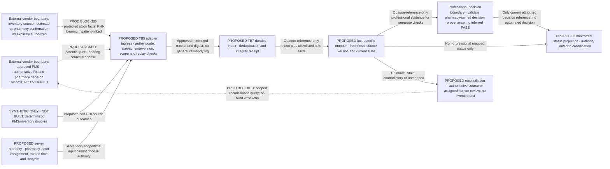
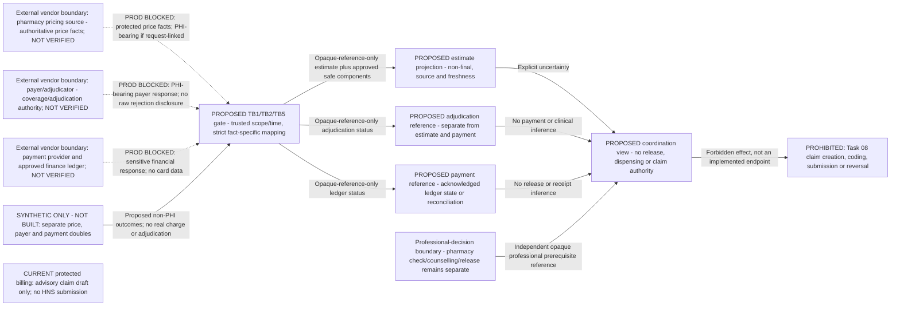

# Task 08 — Trust boundaries and data flows

**Status: WORKSTREAM B DOCUMENTATION / PROPOSED DESIGN ONLY. All six diagrams are logical designs, not deployed topology or implementation approval.**

## 1. Scope and reading rules

Prepared on `task-08-fulfilment-delivery` at HEAD `14403be91075d71d7b13549f55f7d56ed63a86b8`; the tree was clean before this two-file slice. Only the three Workstream A documents separate this HEAD from their implementation-audit baseline `89f7611203057c2cf4feb192faa2cba86233aea7`. No implementation evidence or test PASS is newly asserted.

Authorities: [AGENTS.md](../../AGENTS.md), the complete [Task 08 specification](../tasks/autonomous-pharmacy/TASK-08-fulfilment-and-delivery.md), [project overview](../PROJECT_OVERVIEW.md), [current state and gaps](current-state-and-gap-analysis.md), [standards mapping](ontario-fulfilment-standards-and-policy-mapping.md), and [decision register](production-dependency-and-decision-register.md). The companion [threat model](fulfilment-threat-model.md) supplies actors, assets, evidence E01–E09, existing test precedents V01–V05 and planned obligations T08-B-T01–T30.

This is not Workstream C's approved professional-responsibility matrix, Workstream D's schema, Workstream F's complete state/transition register, Workstream K's executable integration contract or a production architecture approval. No policy duration, retry threshold, service area, role grant, signature exception, financial rule or retention period is selected. All are pending where the existing register says so.

### Diagram legend

| Label / notation | Meaning |
|---|---|
| `PROPOSED` | Logical Task 08 component, not implemented. An arrow is a proposed contract dependency, not a configured call or authorized effect. |
| `SYNTHETIC ONLY - NOT BUILT` | Future deterministic, server-owned local test double, fixed clock/approved Ontario timezone, fictitious records and no network. It cannot establish real professional, financial or physical facts. No fixture is created by this document. |
| `CURRENT` | Existing production-oriented source code, not proof of deployment; used only where explicitly labelled. |
| Dotted arrow labelled `PROD BLOCKED` | External/vendor, live-data or physical operation requiring separate approval. No vendor is selected, no connection exists, and none is activated here. |
| `PHI-bearing` | Future protected flow containing potentially identifying health, address, contact or evidence categories. **No actual PHI values are present or permitted in this slice or its future synthetic fixtures.** The label is a risk classification, not collection permission. |
| `Opaque-reference-only` | No raw clinical/contact content; only minimum approved references and, where stated, safe status/version metadata. References remain sensitive, non-public and independently authorized; opacity is not anonymization or bearer authority. |
| `Professional-decision boundary` | Authorized pharmacy professional and approved pharmacy system supply the actual decision. AgentRx may validate attribution/prerequisites, never recommend or infer the professional decision. Exact role/scope approval remains pending. |
| `Authoritative source` | Authority for the **named fact only**, after approved identity/provenance/freshness checks; not blanket authority over other domains. Most sources below are requirements, not verified integrations. |
| `Physical custody` | Movement of a package, separate from API status. Software evidence must match reality; unknown holder stays `CUSTODY_UNKNOWN`, not an invented handoff. |

PHI-bearing labels apply to the blocked future production case only. Every synthetic branch supplies non-PHI surrogates to the same proposed logical validation boundary; it does not bypass that boundary or enable a production connection. Task 04 fixtures/approval are not reused or extended. Provider responses, caller references and signed events remain untrusted inputs until the relevant checks pass.

### Current versus proposed topology

| Category | Evidence-grounded facts | Not implied |
|---|---|---|
| CURRENT production-oriented | [Public intake actions](../../src/app/(intake)/assessment/actions.ts) collect zero PHI; [staff guard](../../src/lib/auth-guard.ts) and [pharmacy configuration](../../src/lib/pharmacy-config.ts) enforce current staff/single-pharmacy scope; [assessment schema](../../src/lib/db/schema/assessments.ts) records clinical subjects and assessments. | No Task 08 patient request/upload, patient session, neutral pharmacy routing, inventory, release, pickup, delivery or tracking service. |
| CURRENT protected claim/governance | [Claim derivation](../../src/lib/claims/derive-claim-draft.ts) produces advisory drafts; [draft panel](../../src/app/(dashboard)/pharmacist/assessment/ClaimDraftPanel.tsx) states no HNS submission; [governance](../../src/lib/governance.ts) handles existing records, not medication custody/disposal. | No payer/payment/claim-submission integration and no Task 08 audit/retention authorization. No protected writer is a target of these flows. |
| EXISTING SYNTHETIC | [Sandbox deny adapters](../../apps/experiment-sandbox/src/integrations/adapters.ts), [Task 01 safeguards](../task-01/README.md), booking transaction/capability examples listed in threat model E06–E07. | Named payment/courier/storage stubs are not active vendors. Booking is not inventory or professional release. Task 04's [renewal](../task-04/decisions/task-04-synthetic-scope-renewal-v3-2026-08-19.md) remains DRAFT — NOT GRANTED. |
| PROPOSED / BLOCKED | Task 08 request coordination, strict adapter gates, professional references, custody/reconciliation and tracking depicted below. | Task 05 identity and [Task 07 A–J communication design](../task-07/README.md) have no integrated runtime. Task 03 Rx/PMS and Task 09 finance ownership are unresolved, not implemented services inferred from task numbers. |

## 2. Trust-boundary register

| ID | Crossing | Proposed validation / authoritative source | Current limitation and decision |
|---|---|---|---|
| TB1 | Patient, delegate, pharmacy, operations, support or courier device → server | Task 05-derived current session, separate audience/actor/subject relationship, action, assignment, revocation and trusted time; strict bounded request and safe generic response. | Staff guard exists, but missing patient/courier/recipient domains cannot be filled with staff-cookie reuse. T08-D06/D14. |
| TB2 | Server authorization → scoped resource/transaction | Server-only pharmacy authority plus valid subject/request/item/package relationships; no browser, QR, session-selected or provider-selected tenant. Reference resolution is not authorization. | Preserve root `PHARMACY_ID`. Choice conflict remains blocked; do not copy Task 04 grants or expose a tenant selector. T08-D13/D18. |
| TB3 | Choice/evidence input → pharmacy review | Choice is reversible intent; evidence/OCR is unverified. Approved owner must supply pharmacy destination/provenance without changing tenant authority; professional acceptance comes separately. | No upload/evidence service or approved multi-pharmacy choice model. Public intake remains zero-PHI; AI-RX-06 remains retired. T08-D05/D13/D17. |
| TB4 | Coordination task → professional decision | Authenticated assigned registrant and approved pharmacy record, current decision/source/state versions, required checks/counselling and revocation. | No Task 08 role/release matrix; administrative status, payment or webhook cannot become authority. T08-D20. |
| TB5 | AgentRx adapter → external PMS/inventory/payer/payment/courier/address/communications vendor, and back | Approved service identity, encryption and least privilege; bounded strict request/response, signature/replay/account/environment/scope checks, acknowledgement and reconciliation by the fact owner. | All connections BLOCKED. No API/SDK/credential/provider contract approved; raw event is not accepted business truth. T08-D28/D29/D30. |
| TB6 | Pharmacy custody → transport → recipient or returned pharmacy custody | Current release before pickup, assigned courier and correct package; separate recipient authorization/proof and pharmacy acceptance; return receipt distinct from stock disposition. | Physical operations blocked. No policy for signature/exception, route, temperature or return is invented. T08-D23–D27. |
| TB7 | Concurrent request/worker/event → durable state, audit and outbox | Trusted clock, actor/tenant/operation/resource/payload-bound idempotency, version/lock discipline, validated replay and approved atomic audit/outbox; uncertain external effects reconcile before retry. | No Task 08 database, inbox/outbox, worker or scheduler exists. Task 04 examples do not supply external atomicity. T08-D18/D29/D32. |
| TB8 | Authoritative protected data → patient view, notice, label, telemetry or support | Field-minimized projections, per-read authorization, no-store/referrer controls; Task 07 consent/contact authority for generic notices; no raw source errors or authorizing URLs. | No Task 08 tracking/notice runtime or approved courier field list. Opaque references may still reveal sensitive relationships. T08-D07/D30/D31. |
| TB9 | Runtime/configuration, governance, retention, backup or vendor administration | Exact-candidate Task 01/11 scope/lifecycle, fail-hard synthetic isolation; approved dataset holds/retention/incident/access and key custody. | No inherited G1/Task 04 authority, Task 08 risk acceptance, retention period, migration or production gate. T08-D02–D04/D10/D30/D33/D34/D37. |

The current proxy is an optimistic UX gate, not authorization for any future command. No edge relies on hiding UI, possession of a reference, vendor signature alone or client-supplied role/time. Every future mutation must satisfy TB1/TB2/TB7/TB9; every future sensitive read must independently satisfy TB1/TB2/TB8/TB9.

## 3. F1 — Patient request to pharmacy review

**Current evidence:** root intake is a zero-PHI symptom handoff; assessment prescription snapshots are clinical records, not uploaded prescription acceptance (threat evidence E01–E02/E09). There is no current Task 08 patient request or review queue. The diagram leaves both the patient-identity and pharmacy-choice decisions unresolved.

```mermaid
flowchart LR
    U["PROPOSED patient or authorized-agent UI - untrusted"]
    I["PROPOSED Task 05 authority - session and actor-subject grant; unavailable"]
    G["PROPOSED TB1/TB2 server boundary - scope and action checks"]
    C["PROPOSED choice intent - NOT tenant authority; routing decision BLOCKED"]
    E["PROPOSED evidence boundary - request and upload are UNVERIFIED"]
    Q["PROPOSED pharmacy review task - no validity or release implied"]
    P["Professional-decision boundary - authorized pharmacy review; PROD BLOCKED"]
    R["External vendor boundary: approved PMS - authoritative prescription record; NOT VERIFIED"]
    S["SYNTHETIC ONLY - NOT BUILT: local request and professional-reference double"]
    U -->|"Future PHI-bearing request body; no authority fields"| G
    I -->|"Protected server facts; never browser-selected scope"| G
    G -->|"Opaque-reference-only choice intent"| C
    C -->|"No routing until T08-D13 resolution"| E
    G -->|"Future PHI-bearing evidence; approved separate intake only"| E
    E -->|"Opaque-reference-only task; safe unreviewed state"| Q
    E -.->|"PROD BLOCKED: protected PHI-bearing evidence access"| P
    Q -.->|"PROD BLOCKED: professional review request"| P
    P -.->|"PROD BLOCKED: authoritative prescription decision / PHI-bearing record"| R
    R -.->|"PROD BLOCKED: validated opaque decision reference, not raw record"| Q
    S -->|"Proposed non-PHI surrogates through the same checks"| G
```

- **Authority:** AgentRx could own submission/provenance of a coordination request only. Task 05 would own identity/relationships; the approved pharmacy and its system would own prescription authenticity, validity, refill quantity, transfer/renewal and clinical clarification. No service is silently assigned to Task 03 by number.
- **Choice block:** the direct evidence branch does not bypass choice. The review task cannot be assigned/routed until a separately approved destination relationship is verified. A patient may express/change intent; it must never select server tenant scope or be forced into a mandatory pharmacy. No routing mechanism is chosen here.
- **Data minimization:** the queue receives approved references/status, not unrestricted OCR or raw clinical content. An authorized reviewer would fetch necessary evidence through a separately approved protected channel. Raw content must not enter technical audit/outbox/logs.
- **Fail closed:** wrong subject/scope, missing identity/choice authority, unverified source, unknown drug/jurisdiction classification, or unresolved professional fact blocks downstream acceptance/reservation/preparation/financial/handoff effects. A copy, upload, patient statement or OCR output remains evidence.
- **Review/test links:** R01–R06/R29/R30; T08-B-T01–T06/T29/T30. Decisions T08-D05/D06/D13–D17/D20 remain pending. No test implementation or grant is supplied.

## 4. F2 — Pharmacy system to AgentRx status synchronization

**Current evidence:** no active PMS, inventory, fulfilment inbox or reconciliation service exists. Task 04 trusted-time/idempotency/outbox code is a synthetic example only (E07). The proposed mapping accepts source facts only for their defined domain; a callback does not directly set professional state.

- **Authority:** PMS review/release references still require current professional audience, registrant/assignment, patient/item and source/state version checks at TB4. The non-professional branch cannot accept a prescription, complete counselling, release or override a decision. A wholesaler/cache observation remains an estimate, not confirmed available-to-dispense stock.
- **Data:** protected prescription/clinical source payloads may be PHI-bearing in a future integration. Only the approved minimum may cross to the mapper; receipt persistence, encryption and retention need field-level approval. Technical logs, audit and outbox never receive OCR, raw body, medication, address, payer identifiers or arbitrary metadata.
- **Concurrency:** inbox acknowledgement is receipt of an event, not acknowledgement of a professional/financial/physical effect. Source ordering, environment/account/pharmacy binding and authoritative version checks prevent old or terminal-regressing events from overwriting newer facts. Local transactions cannot make vendor operations atomic.
- **Failure:** uncertain acknowledgement, rejected signature/schema, missing actor/provenance, expired facts, unknown status or disagreement yields no downstream progression. Reconciliation may later query an approved authority or ask its human owner; it cannot manufacture acceptance or stock truth.
- **Review/test links:** R03–R04/R07–R10/R21–R28/R30; T08-D18–D20/D28–D30/D32. Exact adapter schemas, signing policy, retry windows, inbox storage and event registry are deferred, not silently defined by this diagram.

## 5. F3 — Price, adjudication, payment and claim separation

**Current evidence:** minor-ailment advisory claim derivation exists, but no adjudicator, payment ledger/provider, dispensing-price authority or HNS submission is established (E03/E08). Task 09's actual scope is disabled interoperability; it is not assumed to own finance.

- **Intentional disconnection:** `B` has no incoming Task 08 edge. Possessing a price, adjudication, payment or delivery reference cannot invoke claim creation, change eligibility/PIN/fee, submit or reverse a claim. Current draft creation remains exclusively in its existing clinical workflow. No protected billing modification is proposed.
- **Independent truths:** an estimate can expire/change and is not a final amount or coverage guarantee. Adjudication acceptance/rejection/reversal is not payment or clinical advice. Payment authorization/capture/refund is not professional release, dispense or patient receipt. Any future billing action belongs to the independently approved billing owner and its own current checks, outside this Task 08 flow.
- **Professional boundary:** `H` is an independent pharmacy requirement, never derived from payment/courier availability. Its opaque references remain server-side and action-scoped; financial data cannot replace it.
- **Failure:** price changes require the approved patient-confirmation policy; unknown or late/reversed payer/payment outcomes require their authoritative owner to reconcile before retry. Capture timing, partial fulfilment, cancellation, refunds/fees and ledger selection are PENDING, not defaults.
- **Data:** only authorized minimized financial status may reach a future protected patient view. No card details, payer IDs, raw errors or PHI in URLs, technical keys, logs, audit, outbox or unsecured notices. No real financial operation is authorized.
- **Review/test links:** R10–R13/R21–R28/R30; T08-D08/D21/D22/D28/D29/D37. No hardcoded billing value, new claim effect or exactly-once payment promise.

## 6. F4 — Pharmacy release to courier custody to patient/agent receipt

**Current evidence:** none of the Task 08 release, package, courier, recipient-grant or proof machinery exists (E09). Existing clinical completion and booking confirmation are not professional release. This flow separates the physical handoff from raw provider evidence and pharmacy acceptance.

```mermaid
flowchart LR
    P["Professional-decision boundary: authorized pharmacy professional - release and counselling authority"]
    G["PROPOSED TB1/TB2/TB4 guard - current item release, plan, identity, version and no blocker"]
    K["PROPOSED pharmacy custody - server-only item/package manifest; READY only if all guards"]
    C["External vendor boundary: approved assigned courier - transport source only; NOT VERIFIED"]
    U["Patient or prior authorized agent - distinct from courier; recipient assurance required"]
    E["PROPOSED raw proof/scan ingress - untrusted evidence, not receipt"]
    V["PROPOSED pharmacy acceptance - current recipient grant, proof integrity and matching attempt"]
    R["PROPOSED HANDED_OFF - accepted patient or authorized-agent receipt"]
    Q["PROPOSED exception/reconciliation - retain known custody or CUSTODY_UNKNOWN"]
    S["SYNTHETIC ONLY - NOT BUILT: release, courier and recipient doubles; no physical effect"]
    P -.->|"PROD BLOCKED: opaque-reference-only pharmacy decision and source version"| G
    G -->|"Approved opaque plan/package references; no clinical metadata"| K
    K -.->|"PROD BLOCKED: physical custody plus approved minimum PHI-bearing transport fields"| C
    C -.->|"PROD BLOCKED: physical handoff only after recipient/release guards"| U
    K -.->|"PROD BLOCKED: direct pickup after pharmacy identity/counselling checks"| U
    C -.->|"PROD BLOCKED: PHI-bearing proof if approved; minimal event reference"| E
    U -.->|"PROD BLOCKED: approved receipt evidence or dispute; potentially PHI-bearing"| E
    E -->|"Opaque-reference-only proof, package, attempt and integrity facts"| V
    V -->|"Matched accepted evidence only; courier custody cannot qualify"| R
    V -->|"Missing, disputed, revoked or contradictory"| Q
    S -->|"Proposed non-PHI surrogates; same guards and acceptance checks"| G
    S -->|"Proposed synthetic transport/proof outcomes"| E
```

- **Before custody transfer:** verify correct professional session/audience/registration/assignment, pharmacy, subject/request/item, current release/counselling, inventory/preparation integrity, package and version; then current mode/recipient/address/service area, courier assignment and all applicable cancellation/financial/reconciliation guards. Do not infer a release, agent or address from payment, link possession, GPS or a provider event.
- **Physical truth:** courier acceptance can establish approved courier custody/`IN_TRANSIT`, never `HANDED_OFF`. A courier is not the patient's agent. Raw delivered/scan/signature evidence alone cannot establish receipt; correct recipient, package/attempt, current authorization, approved proof or professionally approved accessible exception and pharmacy acceptance are required. Disputes remain explicit.
- **Pickup branch:** direct pharmacy-to-recipient handoff applies its own identity, recipient grant, current release, package, counselling and integrity checks. Screen/QR/OTP/phone/email/DOB/address/link alone is insufficient. No-show/expired pickup is not receipt. No unattended, third-party, remote or unapproved curbside pickup is enabled.
- **Data:** a future approved courier would receive only necessary address/contact and transport requirements, not medication, ailment, Rx, prescriber or health number. The pharmacy-owned prescription container label is separate from the minimized outer courier label. Item manifests remain server-side. Raw proof, signatures/photos/identity images and exact location are not collected/retained by default; field-specific necessity and approval are required.
- **Failure:** revoked release, wrong courier/recipient/package, changed address, temperature/integrity exception, missing proof or expired grant blocks handoff/acceptance. Preserve actual custody and professional evidence; if custody cannot be proven, set the explicit unknown state and use F5. A guard cannot undo a physical transfer already made.
- **Review/test links:** R03–R05/R09–R10/R14–R18/R21/R24/R29; T08-D20/D23–D26/D28/D30/D35. Exact identity/signature/exception rules, release/window duration, route/storage limits and vendor data fields remain PENDING.

## 7. F5 — Delivery failure to return to pharmacy custody

**Current evidence:** no delivery, custody exception, return or stock-disposition runtime exists. Existing governance destruction concerns records, not medication disposal (E04/E09). The authoritative decision to reuse, quarantine, destroy or otherwise dispose of medication is never generated by AgentRx.

```mermaid
flowchart LR
    C["External vendor boundary: assigned courier - raw failure/return source; NOT VERIFIED"]
    A["PROPOSED TB5 ingress - strict authenticated scoped event and proof validation"]
    F["PROPOSED DELIVERY_FAILED or CUSTODY_EXCEPTION - no patient receipt"]
    H["PROPOSED custody record - actual holder or CUSTODY_UNKNOWN"]
    P["Professional-decision boundary: pharmacy/DM process - containment and return authority"]
    T["PROPOSED RETURNING - authorized destination and storage/security chain"]
    K["Authoritative physical source: correct pharmacy verifies return receipt and segregation"]
    R["PROPOSED RETURNED - pharmacy custody only; disposition pending"]
    D["Professional-decision boundary: pharmacy disposition; inventory/finance/claims remain separate"]
    S["SYNTHETIC ONLY - NOT BUILT: deterministic failure and return evidence"]
    C -.->|"PROD BLOCKED: protected failure/return data; PHI-bearing if linked"| A
    S -->|"Proposed non-PHI exceptions and return outcomes"| A
    A -->|"Opaque-reference-only accepted exception evidence"| F
    F -->|"No inferred handoff or second attempt"| H
    H -.->|"PROD BLOCKED: opaque-reference-only review task and approved evidence access"| P
    P -.->|"PROD BLOCKED: explicit authorized return plan reference"| T
    T -.->|"PROD BLOCKED: physical return; minimum PHI-bearing transport data"| C
    C -.->|"PROD BLOCKED: physical package and matching return evidence"| K
    K -.->|"PROD BLOCKED: verified opaque receipt reference, not saleability"| R
    R -.->|"PROD BLOCKED: separate professional disposition task"| D
```

- **Authority:** courier raw events describe transport only. Pharmacy-owned reconciliation determines whether evidence is accepted; actual custody must be traced through the return. Correct-pharmacy physical receipt is needed for `RETURNED`; unresolved/missing/wrong-location custody cannot be guessed from a provider status.
- **Failure treatment:** loss, theft, tamper, damage, temperature excursion/missing logger, inaccessible/unsafe address, no recipient, wrong identity, absent/disputed signature, delays or vendor outage block successful receipt. Preserve storage/integrity needs, current holder and required evidence. Do not silently retry, mark received, restock, destroy, refund or reverse a claim.
- **Return and retry:** a second attempt needs a later approved procedure and refreshed release, recipient/address, product/storage/integrity, timing and financial checks. Return requires authorized destination, continuous custody, pharmacy receipt and segregation. A return cannot make medication saleable or authorize re-dispensing; professional disposition and independent financial/claim workflows stay outside automatic coordination.
- **Unknown external state:** reconciliation precedes repeat effects. A pending return cannot rewrite earlier handoffs or eliminate a complaint/dispute. If actual holder is unknown, use `CUSTODY_UNKNOWN`; contradictory canonical state uses `UNKNOWN`, with no progression.
- **Response/privacy:** an approved pharmacy/DM incident process would assign human professional, privacy/security/legal, finance and vendor escalation, with holds and evidence preservation. The application must not determine harm, legal reportability, medication-incident classification or controlled-substance loss. No raw address, signature, route history or webhook body belongs in technical audit/logs. Notification remains generic through F6, not a direct courier SDK.
- **Review/test links:** R17–R23/R27–R29; T08-D25–D29/D32–D35. No return/restock/financial/claim capability is created; professional disposition, retention, reporting, retry and courier procedure decisions remain PENDING.

## 8. F6 — Notification to authenticated patient tracking

**Current evidence:** Task 07 has design documents but no runtime/provider; Task 05 patient identity is not integrated. Existing manual follow-up records and staff routes cannot substitute for either boundary (E01/E05/E08). No public tracking URL, bearer token or notification recipient is provisioned.

```mermaid
flowchart LR
    F["PROPOSED Task 08 accepted coordination projection - no professional inference"]
    O["PROPOSED minimized transactional intent - safe event after accepted commit"]
    N["PROPOSED Task 07 authority - consent, contact verification and generic notice; unavailable"]
    V["External vendor boundary: approved notice provider; NOT VERIFIED"]
    U["PROPOSED patient or authorized-agent device - notice is not access authority"]
    I["PROPOSED Task 05 authority - current session, subject/grant and revocation; unavailable"]
    G["PROPOSED TB1/TB2/TB8 protected tracking read - reauthorize every request"]
    R["PROPOSED minimum safe view - no-store and strict referrer policy"]
    P["Professional-decision boundary - pharmacy-owned source facts remain authoritative"]
    S["SYNTHETIC ONLY - NOT BUILT: local notice sink and identity double; no dispatch"]
    P -->|"Opaque-reference-only current decision provenance, never notice-derived"| F
    F -->|"Opaque-reference-only safe event; no raw clinical/contact data"| O
    O -->|"Proposed Task 07 producer contract; not a direct provider call"| N
    N -.->|"PROD BLOCKED: approved minimum contact data, potentially PHI-bearing; generic body"| V
    V -.->|"PROD BLOCKED: generic notice, no sensitive details or authorizing link"| U
    N -->|"Proposed non-PHI synthetic intent only; NOT BUILT"| S
    U -->|"Sign-in independently; no authority from notice possession"| I
    I -->|"Protected server-derived actor/subject/action facts"| G
    U -->|"Opaque-reference-only request body; no PHI or bearer token in URL"| G
    F -->|"Protected server read; source scope/version rechecked"| G
    G -->|"Minimized potentially PHI-bearing view to the authorized actor for the subject"| R
    S -->|"Proposed synthetic identity facts, through the same read checks"| G
```

- **Authority:** Task 07 alone would resolve approved contact/consent, templates and dispatch; Task 08 does not create a second communications engine. Task 05 separately authenticates and authorizes the read, including relationship/action/pharmacy/request and revocation. An invitation, notification, tracking reference or provider delivery event is not a grant.
- **Patient view:** only the approved minimal state is displayed after authorization, with truthful uncertainty and source freshness. No PHI, pharmacy relationship, recipient/address, financial detail, reusable token or sensitive identifier in URL/query, title, referrer, browser persistence, log or analytics. References travel in protected request bodies and remain independently scoped. A protected status can itself be PHI; minimization does not make it public.
- **Notice:** generic sign-in prompt only; no medication, Rx, ailment, pharmacy name revealing a health relationship, pickup/delivery contents, price/coverage/payment/claim, address, recipient, courier/tracking number, failure reason, message excerpt or bearer secret. Any future generic landing destination must be non-authorizing and separately approved; no tracking-link format is selected here.
- **Lifecycle and failure:** expired/revoked session/grant/approval denies access with generic anti-enumeration, no cached error/details and no alternate public page. Missing Task 07 queues no external effect through another channel. Task 07 must recheck its own contact/consent and relevant cancellation/revocation before dispatch. Provider delivery never means read, understood, clinical follow-up complete or patient receipt.
- **Review/test links:** R03–R05/R21–R25/R27–R30; T08-D06/D07/D29–D35. Exact producer event, safe tracking response, contact fields and template approval remain pending. All prospective test obligations are NOT IMPLEMENTED / NOT RUN.

## 9. Common control and evidence handoff

| Concern across all six flows | Required boundary; not an implemented guarantee | Review dependency |
|---|---|---|
| Identity and scope | Server-derived actor/subject/session/action/pharmacy/assignment, no patient choice or provider input as tenant authority; deny unavailable/unknown grants and roles. | T08-D06/D13/D14; TB1–TB3. |
| Professional truth | Evidence is not prescription; preparation is not check; payment is not release; current pharmacy decision required for READY and all relevant handoffs. | T08-D17/D20; TB4. |
| Financial and physical separation | Courier custody is not receipt; return is not stock disposition; payment/delivery never creates or reverses a claim. | T08-D21–D27; TB5–TB6. |
| Safe concurrency | Proposed state/version/idempotency/receipt/atomic-audit rules must cover duplicate tabs, devices, workers and vendor events. Unknown outcome enters reconciliation before retry. | T08-D18/D29/D32; TB7. |
| Minimized disclosure | Strict allowlisted projections, generic anti-enumeration/errors, no raw logs or PHI in public surfaces; opaque references remain protected and are not authorization. | T08-D30/D31; TB8. |
| Preservation and response | Later approved evidence/retention/holds/backup policies must preserve active custody, disputes and incidents; no automatic legal or professional incident judgement. | T08-D33/D34; TB9. |
| Synthetic isolation and release | All doubles remain proposed, local and non-PHI; no external effects, production imports, fixture widening or transfer of expired Task 04 approval. | T08-D02–D04/D10/D36/D37; TB9. |

These flows cover the six Workstream B diagram deliverables. Threat-model R01–R30 and their paired planned test obligations cover their failure paths. Later evidence must bind tests to an exact approved candidate, real execution results and independent reviewers; no historical Task 04/root test counts carry over. No Mermaid rendering or source inspection proves professional, privacy, security, accessibility or operational readiness.

## 10. Outstanding decisions and continuation boundary

Before implementing an affected behaviour, Royian and the actual domain/specialist reviewers must resolve only the applicable decision-register blockers for that slice and stage. Independent synthetic work may continue when production-only dependencies remain blocked, but runnable synthetic implementation still requires exact synthetic-scope approval and applicable Task 11 approval. Production-only decisions are not blanket prerequisites for unrelated documentation/design work. All Task 08 mandatory stop conditions remain controlling: stop the affected workstream when one is triggered, and never guess missing policy or bypass a protected boundary. The outstanding decision areas remain: prescription/PMS and financial owners; Task 05 relationships/recipient assurance; neutral reversible choice versus singleton tenancy; current sources/accreditation/Internet-site interpretation; drug/jurisdiction exclusions; professional and inventory/release rules; payer/payment policy; pickup/address/courier/proof/return procedures; Task 07 handoff; audit/retention/incident/accessibility controls; and exact Task 01/11 scope/lifecycle/review. No reviewer, expiry, risk tier, retention period, provider or threshold is invented here.

The existing Workstream A documents are preserved as historical evidence; their statement that Workstream A alone did not authorize runtime is unchanged. This separately authorized Workstream B adds design documentation only and does not close any production gate. Ontario source versions, dates and interpretations remain NOT VERIFIED; the OCP Internet Sites review remains unresolved; PHIPA is not described as universally requiring Canadian hosting.

**Current outcome:** six proposed flows, no runnable Task 08 system, no PHI or real prescription data, no migration/authentication change, no database/network/vendor operation and no external notification. Synthetic runtime/test evidence is NOT IMPLEMENTED / NOT RUN. Live pilot and all production fulfilment connections remain BLOCKED.
